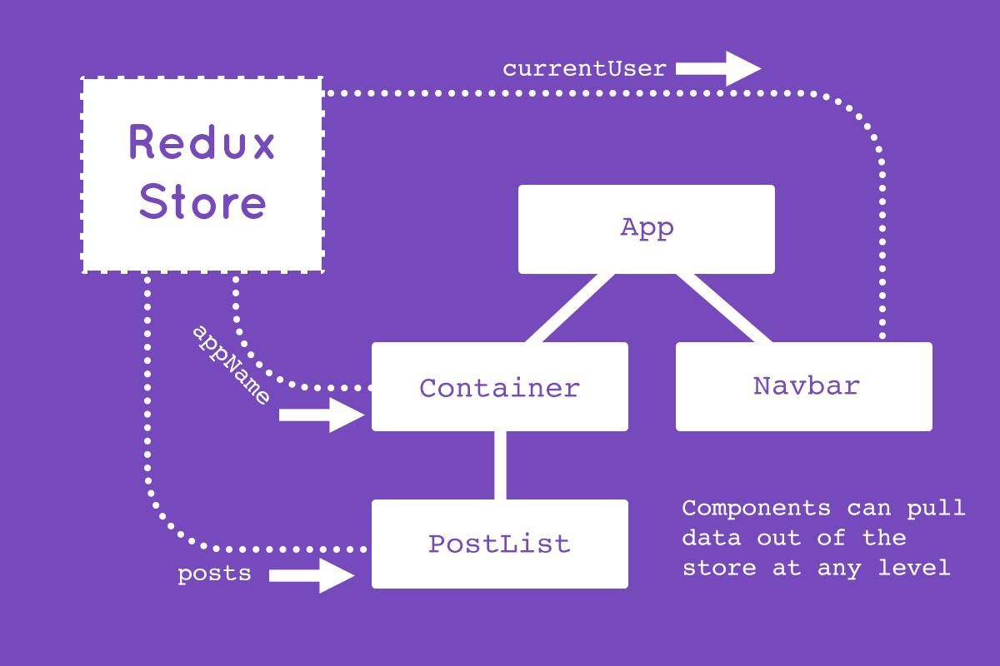
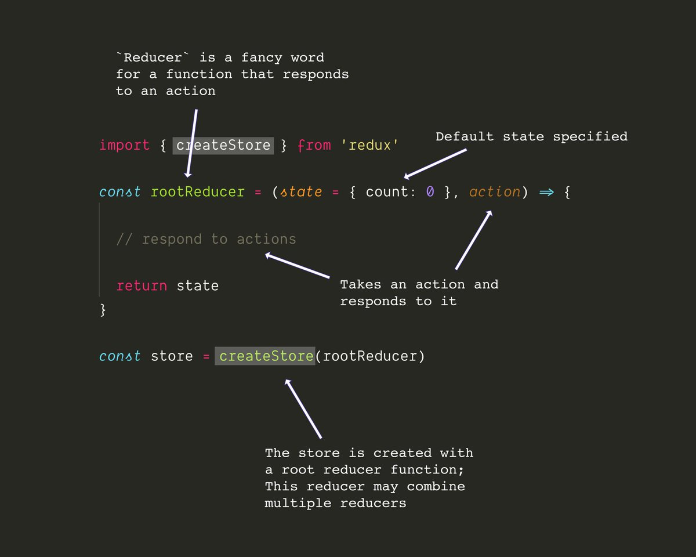
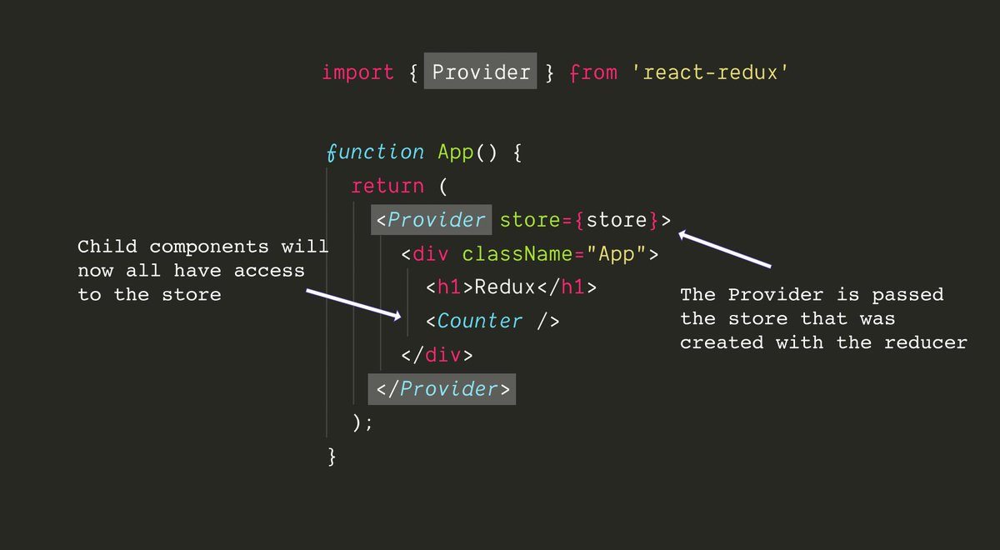
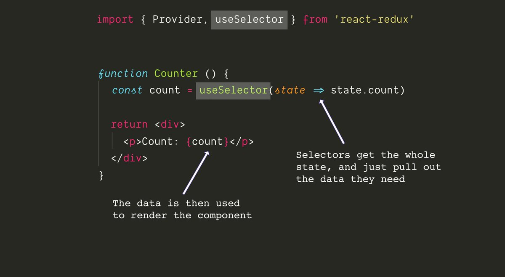
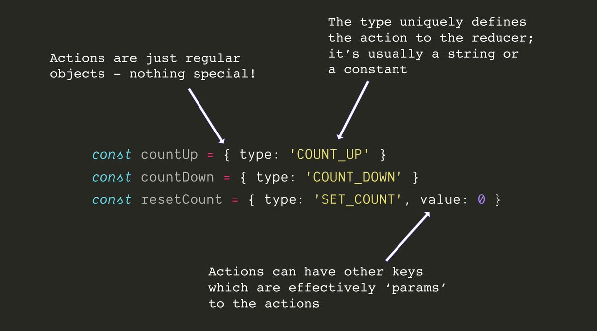
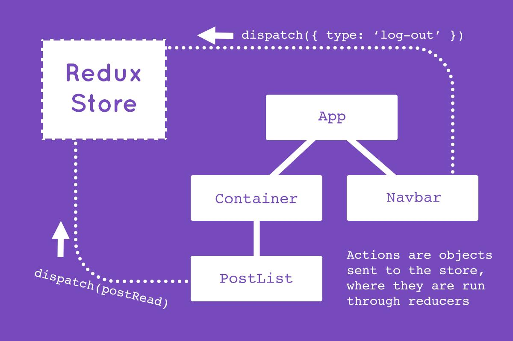
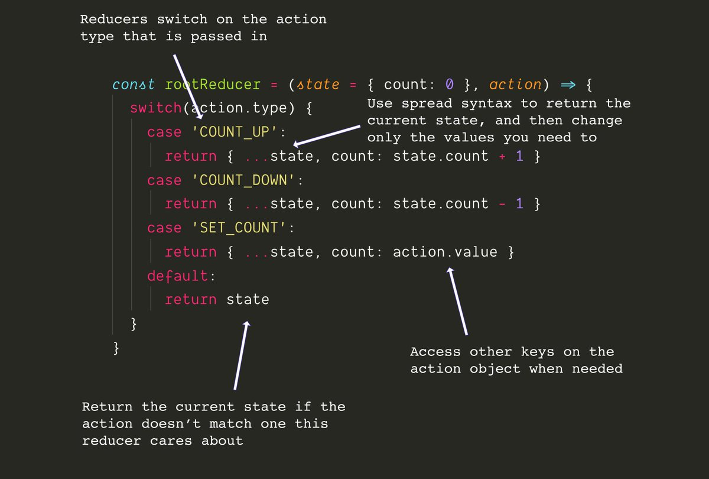
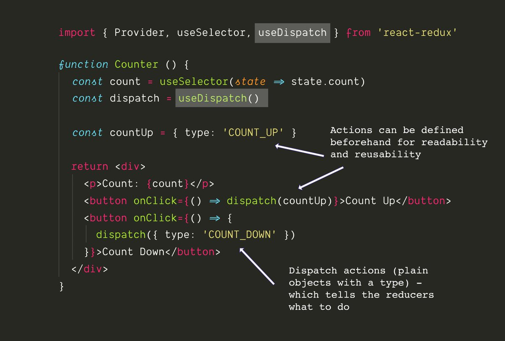

# Redux

## Quick intro

Redux gives you a central place to put your states (data) for JS/TS apps. 
It's most often used with React (via React-redux).
This lets you access or change your state from **any** component in your tree.

___
### Reducer
Your state lives in a central Redux store. 
That store is created with a function called a ```reducer```. 
A reducer takes in a `state` and an `action`, and returns the same or a **new** state.
```js
reducer: state, action => newState
```

___
### Provider
The store is given to your app using the `Provider` from react-redux. 
Use the provider to wrap the entire app, so that any component in your app can access the store.

___
### Selector
To get data out of the store, use the `useSelector` hook from react-redux. `selector` is a fancy word for: _function that gets data out of the store_

___
### Actions
Actions are plain JS objects. All actions should have a `type` key. They may also have additional keys (parameters), `payload` that are needed by the reducer to generate the new state.

___
### Dispatch
Actions are not _called_, but are `dispatch`ed to the reducers. The action `type` is what tells the reducer what to do, i.e. return a new state or remain in the old one.

___
### Reducer, with a vengeance
To change data in the store, first write your `reducer`.
Reducers are often written with `switch/case` statements, but don't have to be. They just have to take in an `action` and a `state`, and return a new state.

___
### Pure functions
It's important that reducers return a **new** state object (and not mutate the old one) so that your components will re-render when something changes.
Don't _set_ state values in reducers - only ever return a new state object with changed values.

___
### Dispatch, with a vengeance
To dispatch an action, use the `useDispatch` hook from react-redux. 
Call useDispatch with an `action` object which will run through the reducers and will potentially change the state.

___
### Update
All the connected components (that call `useSelector`) will automatically get the new state. This is treated like props or state changing - `useSelector` will automatically detect changes and React will re-render the component.

## TL;DR

That's the basic, the core is always:

1.  Dispatch an action to the store
2.  Which may or may not change the state via reducers
3.  Get that state with a selector
4.  Changes will automatically re-render your app

