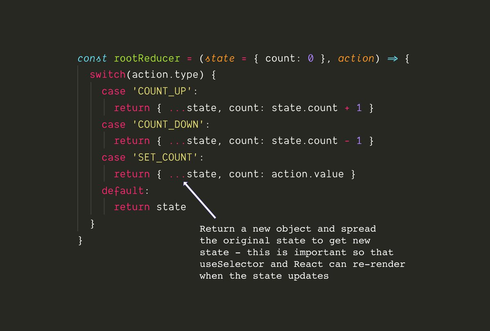

# Redux

## Quick intro

``redux`` gives you a central place to put your states (data) for JS/TS apps. 
It's most often used with React (via `react-redux`).
This lets you access or change your state from **any** component in your tree.

* `redux` gives you a store, but it doesn't know anything about React.
* `react-redux` lets you connect pieces of the states to the React components.


It's been implemented to solve the pbms of Hot reloading with Time Travel. That means:

  * Repeat the actions
  * Reproduce the states:
    * No matter how you come to the state X
    * the UI always look the same in state X

How do you adapt the Flux architecture with hot reloading? You need:

  * Immutable data
    * detect change
    * record old state

You end up with a tool that join Flux architecture and the Elm architecture.

You can:

  * Preserve the state
  * Recover from errors
    * Switching to the previous state before errorring

Implementation with Redux:

  1. Add some mock data in the store
  2. Display them
  3. Create the initial state for the app
  4. Create the action that send new data to the store
  5. Create a CTA that triggers the dispatch action
  6. Create the reducer that change the state according to the action dispatched


## Elm architecture:
### User interaction


  * Model — the state of your application
  * View — a way to turn your state into HTML
  * Update — a way to update your state based on messages

1. Elm starts by rendering the initial value on screen. From there you enter into this loop:
   1. Wait for user input.
   2. Send a message to update
   3. Produce a new Model
   4. Call view to get new HTML
   5. Show the new HTML on screen
   6. Repeat!
2. How to work with the ELm architecture
   1. Guess what the **model** should be. *Shape of the data in the store*
   2. Create a **view** based on your model. *React Component using the select hook*
   3. Handle all the cases in your **update**. *Define all the actions in your reducer*

### Async events
https://guide.elm-lang.org/effects/http.htmlgit

## Redux

Redux at its core is a
> change event emitter holding a value

```js
let listeners = []
let state;

function reducer(state, action) {
  return action(state)
}

function subscribe(listener) {
  listeners.push(listener)
  return function unsubscribe() {
    listeners = listeners.filter(cand => cand !== listener)
  }
}

function getState() {
  return state
}

function dispatch(action) {
  state = reducer(state, action)
  listeners.slice().forEach(foo => foo())
  return action
}
```

Constraints:

* Single state tree, an object
* Actions describe updates, an object
* Reducers apply updates, a function

Features:

* Debug workflow
  * Log actions and states, they are objects
  * A bad UI means bad states, find the bad state
  * Check the action, objects are human readable
  * Fix the reducer, the only place where behavior is being implemented
  * Write a test, don't need to render, don't need to mock
* Everything is data
  * Persistence, store state as a json
  * Universal rendering, the state can be created server side and sent to the FE
  * Recording user sessions
  * Optimistic mutations, we can cancel wrong state and remove it from the state tree
  * Collaborative editing

Contract (the rest of the API the user has to code):

* Reducers
  * `(state, action) => state`
  * how the state updates
  * composable, a reducer can call a reducer
  * HOC reducers.
     * supercharge reducers, with internal states, ...
        ```js
        const undoable = reducer => {
          const initState = {
            past: [],
            present: reducer(undefined, {})
          }
          return (action, {past, present} = initState) => {
            if (action.type === 'UNDO') {
              return {
                past: past.slice(0, -1),
                present: past[past.length - 1]
              }
            }
            return {
              past: [...past, present],
              present: reducer(present, action)
            }
          }
        }
        ```
      * reusable with any reducers, make it a package
* Selectors
  * `(state, ...args) => derivation`
  * a derived state, filtered down, more useful for the UI
  * keep the Reducers and the Selectors working on the same state in the same file.
     * if the state is being modified, the relevant selectors are there as well
* Middleware
  * `store => next => action => any`
    ```js
    const promise = store => next => action => {
      typeof action === 'function'
        ? action.then(next)
        : next(action)
    }

    const logger = store => next => action => {
      clg({prevState: store.getState()})
      clg({action})
      const result = next(action)
      clg({nextState: store.getState()})
      return result
    }
    ```
  * abstract actions, can be npm'ed
* Enhancers
  * `createStore => createStore`
    * memoization
    * optimistic state
    * app sheel and offline loading => you can put the store in a service worker

___
### Reducer
Your state lives in a central/global Redux store. 
That store is created with a function called a ```reducer```. 
A reducer takes in a `state` and an `action`, and returns the same or a **new** state.
At all times, the reducer should return a state:

* either the init state when called for the first time
* the current state if there is no change
* a new state otherwise
  
``` 
reducer: state, action => newState
```


___
### Provider
The store is given to your app using the `Provider` from react-redux. 
Use the provider to wrap the entire app, so that any component in your app can access the store.


___
### Selector
To get data out of the store, use the `useSelector` hook from react-redux. `selector` is a fancy word for: _function that gets data out of the store_


___
### Actions
Actions are plain JS objects. All actions should have a `type` key. They may also have additional keys (parameters), `payload` that are needed by the reducer to generate the new state.


___
### Dispatch
Actions are not _called_, but are `dispatch`ed to the reducers. The action `type` is what tells the reducer what to do, i.e. return a new state or remain in the old one. `dispatch` is a built-in function available when you create the store.


___
### Reducer, with a vengeance
To change data in the store (which probably change the state of your application), first write your `reducer`.
Reducers are often written with `switch/case` statements, but don't have to be. They just have to take in an `action` and a `state`, and return a new state.


___
### Pure functions
It's important that reducers return a **new** state object (and not mutate the old one) so that your components will re-render when something changes.
Don't _set_ state values in reducers - only ever return a new state object with changed values.



___
### Dispatch, with a vengeance
To dispatch an action, use the `useDispatch` hook from react-redux. 
Call useDispatch with an `action` object which will run through the reducers and will potentially change the state.


___
### Update
All the connected components (that call `useSelector`) will automatically get the new state. This is treated like props or state changing - `useSelector` will automatically detect changes and React will re-render the component.

## TL;DR

That's the basic, the core is always:

1.  Dispatch an action to the store
2.  Which may or may not change the state via reducers
3.  Get that state with a selector
4.  Changes will automatically re-render your app

# Immer and how to update the states from the store

[Immer](https://immerjs.github.io/immer/docs/introduction) is an easy way to handle immutability. 
It creates a copy/draft of the original object and you modify that draft the way you want without worrying about immutability.

https://daveceddia.com/react-redux-immutability-guide/
## Basic syntax
### Produce and draft
### Immer in a switch case
## Basic state manipulations
### Update an object
### Update an object in an object
### Update an object with a key
### Prepend an item to an array
### Add an item to an array
### Insert an item in the middle of an array
### Update an item in an array using an index
### Update an item in an array using map
### Update an object in an array
### Remove an item from an array with filter

# React and Context

a `Context` is a conduit/channel between the `Provider` and all the `Consumers`.

```tsx
// Source.tsx
export const SourceContext = React.createContext()

// Outer.tsx
import { SourceContext } from './Source'
import { Inner } from './Inner'

const Outer: React.FC<IOuterProps> = () => (
  const usefulData = ...

  <main>
    <SourceContext.Provider value={usefulData}>
      <Inner />
    </SourceContext.Provider>
  </main>
)

// Inner.tsx
import { SourceContext } from './Source'

export const Inner: React.FC<IInnerProps> = () => {
  const { usefuldata: info } = React.useContext(SourceContext)
  
  return <p>A useful piece of {info}</p>
}
```


# Implementation with React

We will be using the [Redux Toolkit](https://redux-toolkit.js.org) as it simplify the process and reduces the boilerplate most of the times.

## The Store

Let's make a simple on/off lightbulb. A button will toggle between the 2 states.

```tsx
import produce, { Draft } from 'immer';
import { configureStore, createSlice, EnhancedStore, AnyAction } from '@reduxjs/toolkit';

enum SwichState {
  Off,
  On,
}

interface ILight {
  readonly bulb: SwichState
}

const initialLightState: ILight = {bulb: SwichState.Off}


```

Making the store available across the whole application

```tsx
import { Provider } from 'react-redux'

const App: React.FC<IApp> = () => (
  <Provider store={store}>
    <MyFancyPony />
  </Provider>
)
```

Now that the store is availbale the components (MyFancyPony and its children) need to connect to the store.

# Testing the Store

# Best practices

1. Do not store derived states. If `a=10` is store, don't store `b=a+1`
   1. compute them in the View
2. 