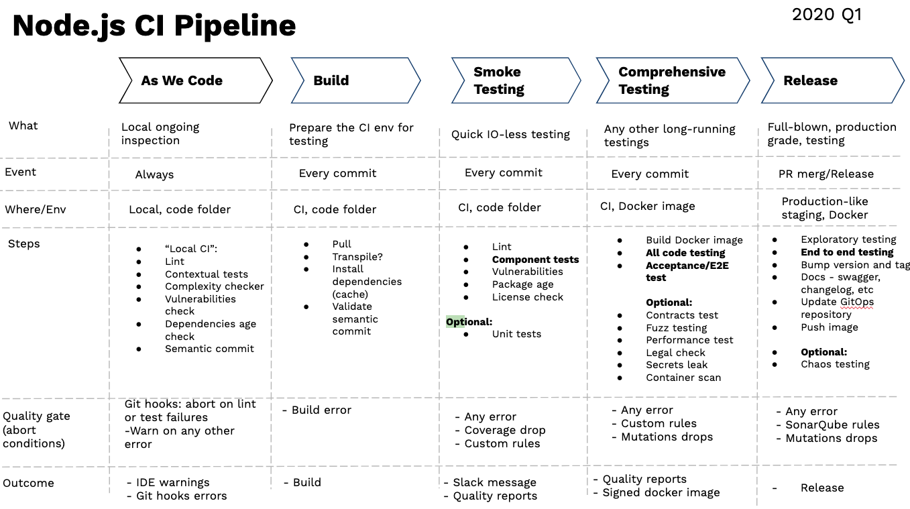

# Approach



## Test should be thought of as an optimisation problem

It's about maximising value (confidence in the app working) and minimising cost (time spent maintaining and running tests).

Questions to ask for each test series:
  1. What's the possibility that this series will catch bug?
  2. Is this test adding value (increase confidence...)?
  3. Is there a better test:
     1. Same level of confidence
     2. Easier to maintain/write/run

## Avoid excessive mocking 

You get away from reality every time.

## Tests should facilitate refactoring

1. No test should fail when refactoring while no user-facing behavior is changed.
2. If user-facing behavior is changed, at least one test should fail.

## Tests should mimic how users actually use the app

The tests should interact with form elements, buttons, ..., the same way a user would.
They sohuld never reach into a component and manually change inner states or anything specific to the implementation of the components.

Since the user-facing behavior is what you ultimately want to assert, it's logical that the tests should be operating in a way that closely matches a real user.

You should test how it works, not how it looks (avoid snapshot testing)

# Tools

## Typescript

  * Backend services communicate via gRPC, which allows to generate types from `graphql-code-generator`.
  * Queries, mutations and subscriptions components/hooks are generated with full type coverage.

You should aim for end-to-end type coverage. 

## Jest & @testing-library/react

Unit tests are about testing the fine-grained details. Integration and E2E tests could be too costly for each possible case.

# Cypress, integration tests

First test to run because they cover a lot at first for a fairly small effort.

The network layer is mocked:
  * Tests run faster
  * Tests are more reliable
  * Hard to replicate scenarios con be simulated with ease. 

Since you have a 100% type coverage, you have a guaranty to be at least structurally equivalent with the unmocked backend.

# Cypress, E2E tests

Do not mock anything at this stage. The tests are higher cost. 
Tests need to start from a known state, do some operation and arrive at some expected known state. Since this is not mocked, ensuring you start at a known state is more expensive.

Tipycally used for the most important functionalities (registration, login, configuring, ...) 


---
```javascript
describe('clipReducer/setClipStopTime', async assert => {
  const stopTime = 5;
  const clipState = {
    startTime: 2,
    stopTime: Infinity
  };

  assert({
    given: 'clip stop time',
    should: 'set clip stop time in state',
    actual: clipReducer(clipState, setClipStopTime(stopTime)),
    expected: { ...clipState, stopTime }
  });
});
```


---
https://blog.stackpath.com/frontend-testing/